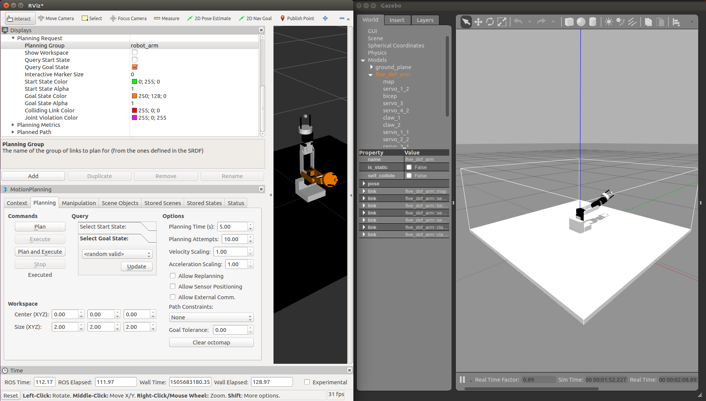

# five_dof_robot_arm
ROS implementation of the aluminium chinese built 5-6 DOF robot arm. My implementation has 5 DOF because the servos used were too weak to even support the arm itself.

<div style="text-align:center"></div>

As for all my repositories so far, this is simply a way for me to document my projects in robotics. If you wish to replicate this robot arm, I suggest looking into Mastering ROS For Robotics Programming book. It doesn't explicitely tell you how to implement it with the arduino but you will have enough insight to do it yourself. You can contact me at ferasboulala@gmail.com if you have any questions. This was my first contact with ROS so it don't count on this repo to offer too much insight on the framework. I highly suggest to refer to Mastering ROS For Robotics Programming because it details everything. ROS documentation is not bad either.

- This robot can follow a trajectory dictated by MotionPlanning (MoveIt!). 
- You can also use sliders or joysticks to control it manually. If the switch's on, joystick control is enabled. Otherwise, slider/software control is enabled.
- The robot can be vizualised with RViz and Gazebo. 
- A placeholder function can make it learn a sequence and play it back to you. It is still under work. 
- Essentially, a node reads the ``` five_dof_arm/Joint_states```  and publishes them to the arduino.

# A. Software prerequisites
  0. Ubuntu 16.04+
  1. ROS kinetic
  2. MoveIt!, Gazebo and controller plugins. (refer to chapters 2 to 4 from  http://pdf.th7.cn/down/files/1603/Mastering%20ROS%20for%20Robotics%20Programming.pdf)
  3. rosserial_arduino (see http://wiki.ros.org/rosserial_arduino/Tutorials)
  
# B. Hardware requirements
  1. Arduino board (nano in my case)
  2. 6 DOF robot arm from ebay/banggood/aliexpress (ex: https://www.ebay.com/p/1-Set-Black-6-DOF-Aluminium-Mechanical-Robotic-Arm-Clamp-Claw-Mount-Robot-Kit/1332691537?iid=191996564536)
  3. 4 analog 2-axis joysticks
  4. Jumper wires
  5. Switch (or simulate it with a wire)
  6. Battery with voltage regulators depending on the servos you're using. Most likely 5V regulators and a 7.4V Lipo will do just fine.
  
# C. Installation
  1. Prepare all the hardware. Refer to the arduino code found in arduino_implementation. Make sure that all grounds are connected.
  2. Download all the software.
  3. ``` $ roscore``` 
  4. ``` $ roslaunch five_dof_arm five_dof_arm_control.launch``` 
  5. ``` $ rosrun rosserial_python serial_node.py /dev/ttyUSB'n' _ baud:= 115200``` 
  6. For faster tests without the use of Gazebo, you can run ``` $ roslaunch five_dof_arm view_arm```  ``` $ rosrun arduino_implementation arduino_node``` .
  
  There is a good deal of launch files in five_dof_arm/launch. Most of them are generated by MoveIt. The ones that are most important are the ones refered in ```five_dof_arm/launch/five_dof_arm_control.launch``` as they are self built. Same goes for files inside the ```config``` folder. If one wishes to test MoveIt's files, simply run ```$ roslaunch five_dof_arm demo.launch```.
  
